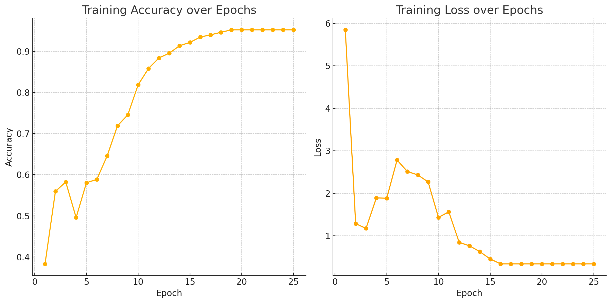
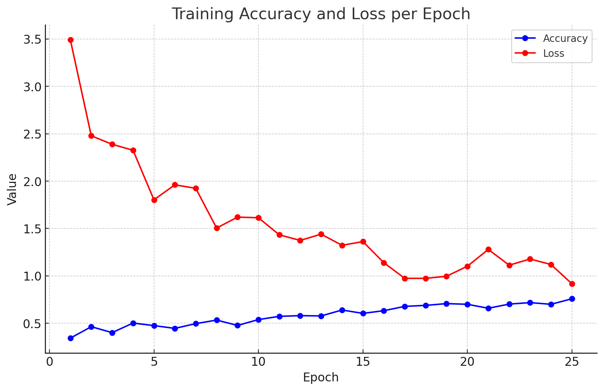
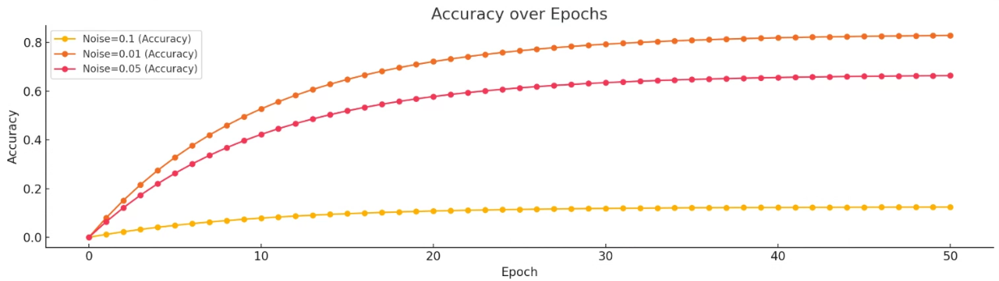
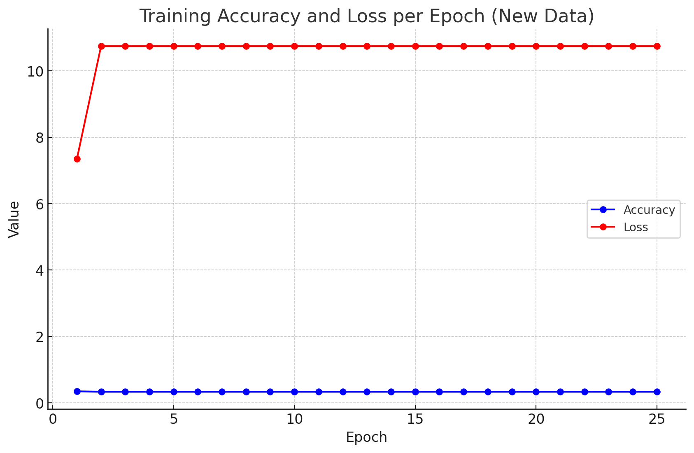

# Federated_Learning_Security


0. 使用TFF套件，實作FL，目前實測0.86.0可以正常訓練不會出現版本相容性問題，並建議在Colab上運行，但Evaluate會出現狀況。
```
python FL_Code/FL_CNN.py
```


1. 使用TFF_DP套件，在FL基礎上加入Differential Privacy，可以發現，加入DP雜訊之後，準確率上升的明顯較慢。
```
python FL_Code/FL_CNN_DP.py
```


2. 在這張圖上可以看到，使用不同的雜訊強度，在同樣Epoch訓練數量的情況下，準確率上升的速度與高度會有明顯差異，越大的雜訊會導致模型訓練速度越慢。


3. 接下來我們針對FL環境，進行投毒攻擊(Poison Attack)，我們將其中一類的數據的一部分，使用Data Injection的方法，竄改成另一類數據的某一部分，使得模型無法擬合。
```
python FL_Code/FL_CNN_Poison.py
```


4. 為了防範Poison Attack的危害，我們針對訓練資料，設計了一個投毒偵測模型，該模型透過Autoencoder實作，透過比較輸入跟原型之間的差異，來偵測異常。
```
python FL_Code/FL_CNN_Poison.py
```

